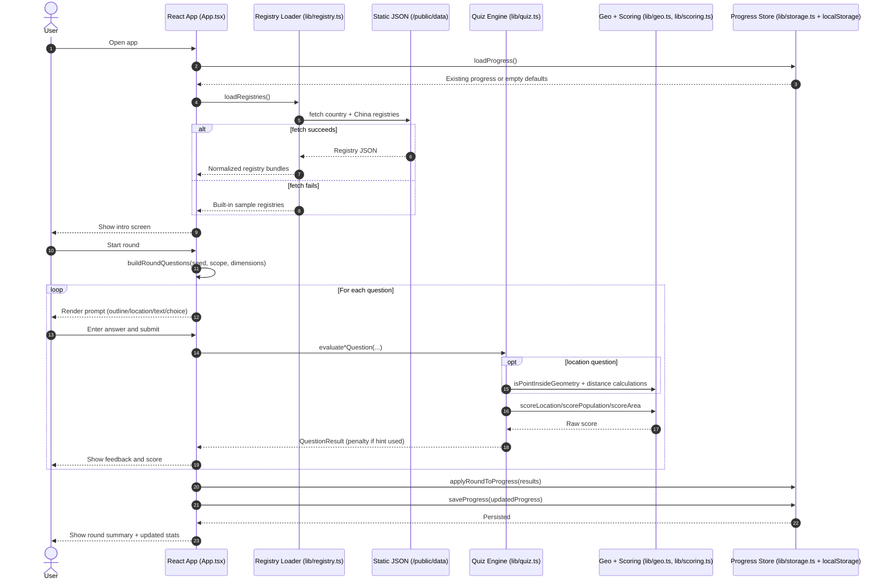

# Geo Fusion Quiz Sequence

```mermaid
sequenceDiagram
  autonumber
  actor User
  participant App as React App (App.tsx)
  participant Registry as Registry Loader (lib/registry.ts)
  participant Data as Static JSON (/public/data)
  participant Quiz as Quiz Engine (lib/quiz.ts)
  participant Geo as Geo + Scoring (lib/geo.ts, lib/scoring.ts)
  participant Store as Progress Store (lib/storage.ts + localStorage)

  User->>App: Open app
  App->>Store: loadProgress()
  Store-->>App: Existing progress or empty defaults
  App->>Registry: loadRegistries()
  Registry->>Data: fetch country + China registries
  alt fetch succeeds
    Data-->>Registry: Registry JSON
    Registry-->>App: Normalized registry bundles
  else fetch fails
    Registry-->>App: Built-in sample registries
  end
  App-->>User: Show intro screen

  User->>App: Start round
  App->>App: buildRoundQuestions(seed, scope, dimensions)

  loop For each question
    App-->>User: Render prompt (outline/location/text/choice)
    User->>App: Enter answer and submit
    App->>Quiz: evaluate*Question(...)
    opt location question
      Quiz->>Geo: isPointInsideGeometry + distance calculations
    end
    Quiz->>Geo: scoreLocation/scorePopulation/scoreArea
    Geo-->>Quiz: Raw score
    Quiz-->>App: QuestionResult (penalty if hint used)
    App-->>User: Show feedback and score
  end

  App->>Store: applyRoundToProgress(results)
  App->>Store: saveProgress(updatedProgress)
  Store-->>App: Persisted
  App-->>User: Show round summary + updated stats
```
